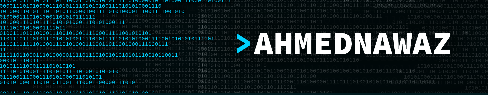

<h1 align="center">Hi 👋, I'm Ahmed Nawaz</h1>
<h3 align="center">Full Stack Mobile & Web Developer from Pakistan 🇵🇰</h3>

<p align="center">
Building scalable SaaS platforms, mobile apps, and AI-powered products.
</p>


<p align="left">
  
</p>

---

## 🚀 About Me

- 💼 Full Stack Developer working on scalable multi-tenant SaaS platforms
- 📱 Specialized in Flutter, React.js, Node.js & Firebase
- ⚙️ Experienced with AWS, Docker, CI/CD & backend architecture
- 🤖 Interested in AI tools, automation workflows & product engineering
- 🧠 Previously worked on Deep Learning & NLP-based projects
- 🌱 Currently exploring AI-assisted development workflows
- 👨‍💻 Building products under **ClosedBrackets**
- 💬 Ask me about **Flutter, SaaS Architecture, Firebase, React, APIs & Mobile Apps**

---

## 🌐 Portfolio & Contact

- 🌍 Portfolio: [ahmednavaz.github.io](https://ahmednavaz.github.io)
- 📫 Email: **ahmednawaz.dev@gmail.com**
- 💼 LinkedIn: [Ahmed Nawaz](https://linkedin.com/in/ahmed-nawaz-657289225)

---

## 🤝 Connect With Me

<p align="left">
<a href="https://linkedin.com/in/ahmed-nawaz-657289225" target="blank">

</a>

<a href="https://www.hackerrank.com/@ahmednawaz_dev" target="blank">

</a>

<a href="https://codeforces.com/profile/ahmednawaz.dev" target="blank">

</a>

<a href="https://leetcode.com/user7580q" target="blank">

</a>
</p>

---

## 🛠️ Tech Stack

### Mobile Development
<p>


</p>

### Frontend
<p>


</p>

### Backend & DevOps
<p>


</p>

### Databases
<p>


</p>

### AI / Python
<p>


</p>

---

## 📌 Featured Projects

### 🚚 doobi® — Multi-Tenant Laundry SaaS
Scalable white-label SaaS platform for on-demand laundry businesses with:
- Flutter apps
- Admin dashboards
- Driver management
- Tenant architecture
- Real-time order workflows

### 🎙️ PodcastDB
AI-powered podcast discovery & analytics platform built with:
- React.js
- Node.js
- PostgreSQL
- OpenSearch
- AWS Infrastructure

### 🧩 ClosedBrackets
Founder-led engineering studio focused on:
- SaaS products
- Mobile apps
- AI-powered workflows
- Startup MVP development

---

## 📊 GitHub Stats

<p align="center">

</p>

<p align="center">

</p>

<p align="center">

</p>

---

## ⚡ Fun Fact

```bash
while(alive) {
   eat();
   code();
   sleep();
   repeat();
}
